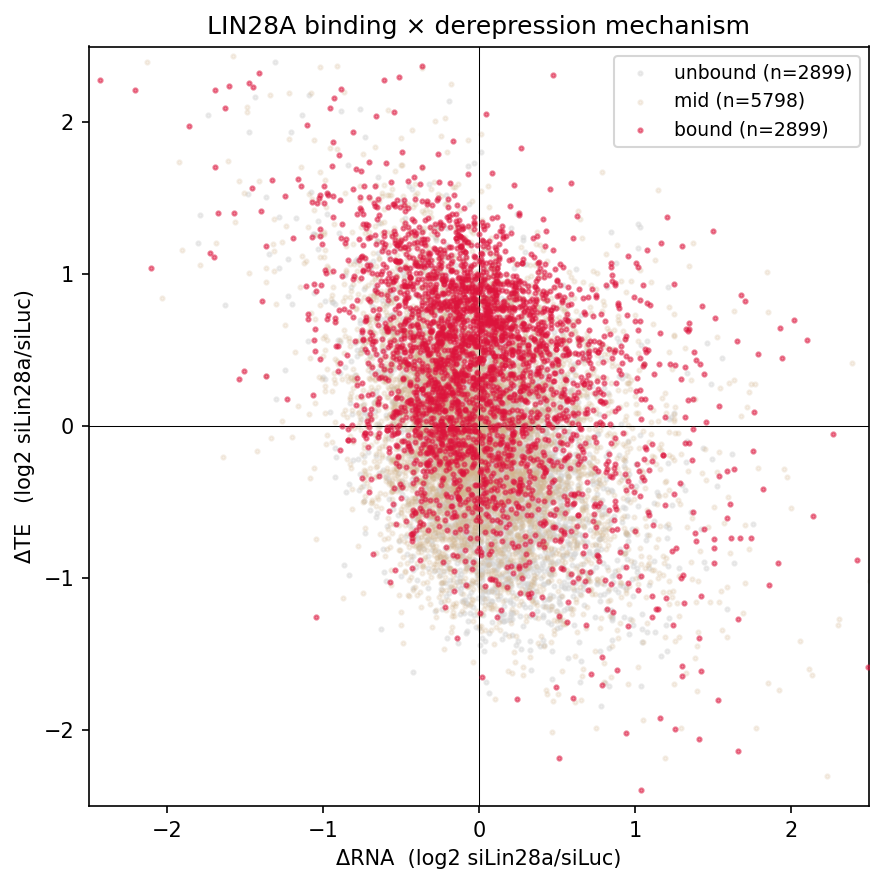
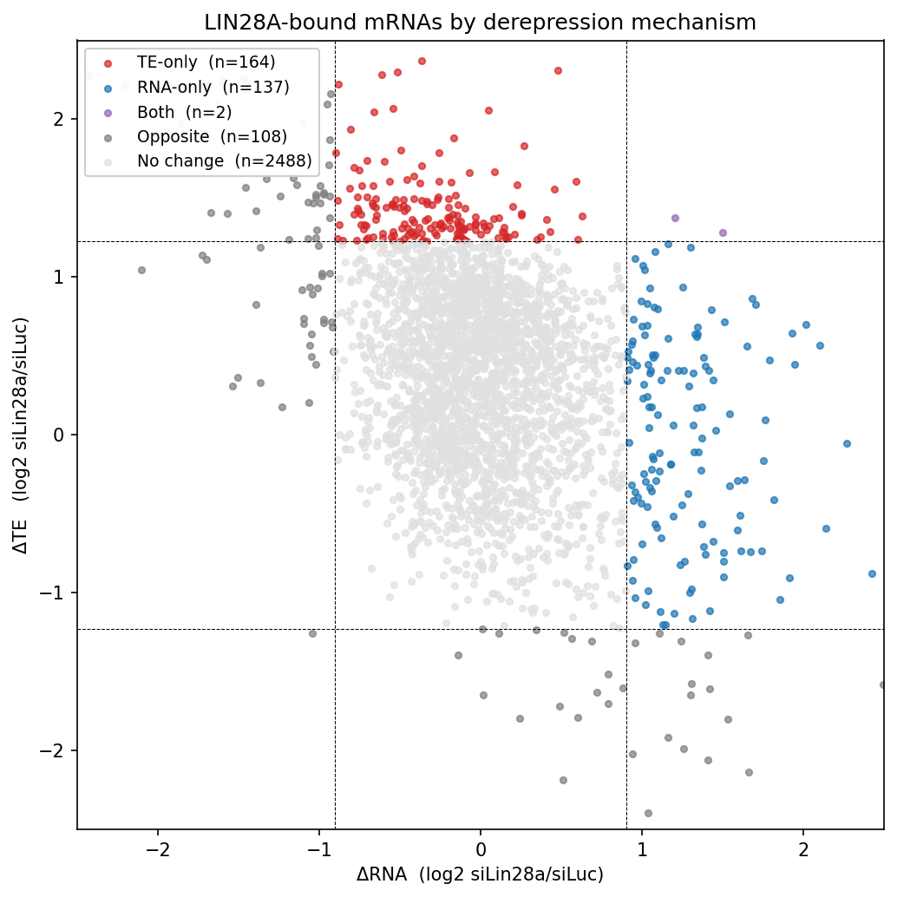
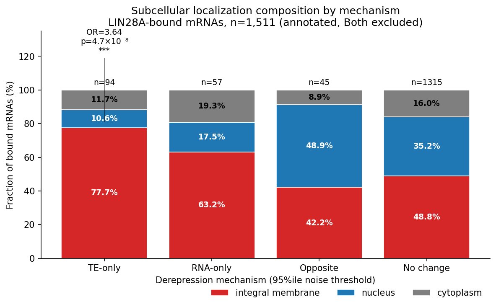
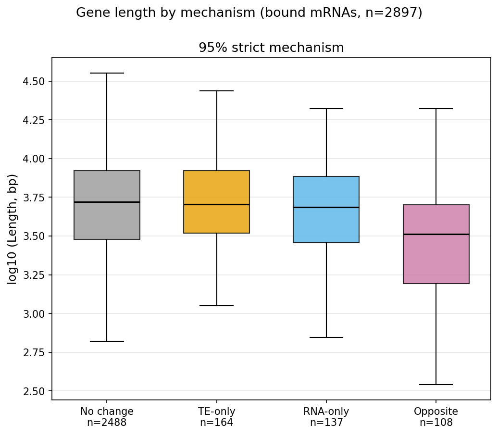
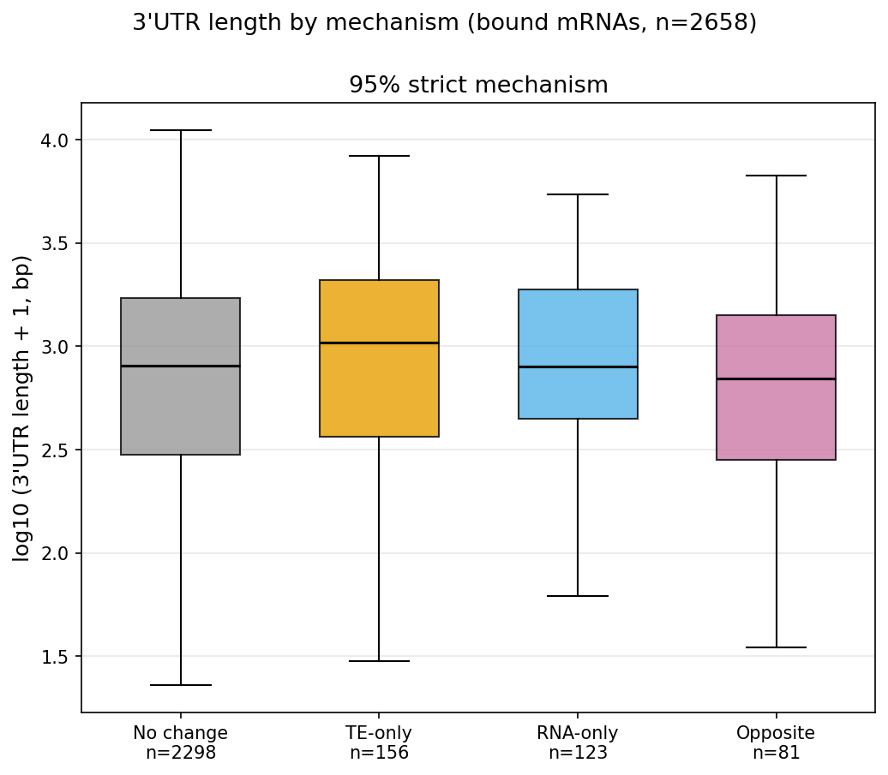

# LIN28A 결합 mRNA의 derepression 메커니즘 분리: Translation-only 억제는 ER membrane 표적 및 긴 3′UTR과 연관된다

**생물정보학 및 실습 1 — Term Project (2026 봄학기)**
서울대학교 생명과학부 · 이정민

원 논문: Cho J. *et al.* (2012) *Cell* 151:765–777, "LIN28A is a suppressor of ER-associated translation."

---

## Abstract

LIN28A는 ER(endoplasmic reticulum)에 결합한 mRNA의 번역을 억제하는 RNA-binding protein으로 알려져 있다. 그러나 LIN28A 결합 mRNA가 *si*Lin28a 조건에서 보이는 derepression이 (a) **번역 효율(translation efficiency, TE)** 의 증가에서 오는지, (b) **mRNA 안정성(stability)** 의 증가에서 오는지, 아니면 (c) 둘 다에서 오는지는 정량적으로 분리되지 않았다. 본 연구는 CLIP / RNA-seq / Ribo-seq(RPF) 데이터를 통합하여 각 결합 mRNA의 derepression을 ΔTE·ΔRNA 평면에서 메커니즘별로 분류하고, mRNA의 분자적 특징(subcellular localization, 전체 길이, 3′UTR 길이)이 이 메커니즘을 구분하는지 검정하였다.

네 가지 결과를 얻었다. (1) 결합 mRNA는 unbound 대비 ΔTE가 유의하게 높지만(p ≈ 10⁻²⁸⁴) ΔRNA는 오히려 약간 낮아, derepression이 주로 **번역 수준**에서 일어남을 정량 확인했다. (2) noise floor 기반 분류에서 한 mRNA가 TE와 RNA 양쪽 모두로 derepress되는 경우는 거의 없었다(**Both ≈ 0.1 %**) — 즉 **메커니즘 특이성(한 mRNA당 하나의 메커니즘)** 이 존재하며 TE-only가 RNA-only보다 우세하다. (3) **TE-only mRNA는 integral-membrane(ER 표적) localization으로 강하게 enrich**된다(Fisher OR = 3.64, p = 4.7×10⁻⁸). (4) TE-only는 전체 길이에서는 No-change와 차이가 없으나(null), **3′UTR만 떼어내면 유의하게 길다**(80 % threshold에서 p = 7.4×10⁻⁶). 종합하면 LIN28A의 translational suppression은 *전체 transcript 크기*가 아니라 **ER 표적 + 긴 3′UTR**이라는 조절 서열 차원의 시그너처를 가진다. 이는 원 논문의 "ER-associated translation suppression" 메시지를 mechanism × mRNA-feature 정량 시그너처로 확장한다.

---

## 1. Introduction

LIN28A는 발생·줄기세포에서 핵심 역할을 하는 RNA-binding protein으로, *let-7* microRNA의 성숙을 억제하는 기능이 잘 알려져 있다. Cho 등(2012)은 PAR-CLIP과 ribosome profiling을 통해 LIN28A가 *let-7* 비의존적으로도 작동하며, 특히 **ER에 결합한 mRNA**의 번역을 억제한다는 것을 보였다. LIN28A를 knockdown(*si*Lin28a)하면 이 mRNA들의 번역이 회복(derepression)된다.

derepression은 원리적으로 두 경로로 나타날 수 있다.

- **Translation 경로 (ΔTE↑)**: 단위 mRNA당 ribosome footprint가 증가 — LIN28A가 풀리며 번역이 회복.
- **Stability 경로 (ΔRNA↑)**: mRNA 자체가 안정화되어 양이 증가.

원 논문은 LIN28A를 *translational* suppressor로 규정하지만, 결합 mRNA 각각에서 두 경로의 상대적 기여와 그 분포는 정량적으로 분리되지 않았다. 본 연구의 핵심 질문은 다음과 같다.

> **Q1.** LIN28A 결합 mRNA의 derepression은 TE·RNA 어느 축에서 오는가? 한 mRNA가 두 경로를 동시에 쓰는가, 아니면 하나에 특화되는가?
>
> **Q2.** mRNA의 분자적 feature(localization, length, 3′UTR)가 이 메커니즘 선택을 예측·구분하는가?

이는 guided mission(논문 figure 재현)과 구별되는 자유 분석 주제로서, 메커니즘 분리와 feature 연관이라는 새로운 가설을 정량 검정한다.

---

## 2. Materials and Methods

### 2.1 데이터

| 라이브러리 | 용도 |
|---|---|
| `CLIP-35L33G` | LIN28A 결합량 (PAR-CLIP) |
| `RNA-siLuc`, `RNA-siLin28a` | mRNA 양 (control / knockdown) |
| `RPF-siLuc`, `RPF-siLin28a` | ribosome footprint (control / knockdown) |

annotation은 **GENCODE vM27** (`gencode.gtf`), subcellular localization은 강의 제공 mouse localization table을 사용했다. 분석 환경은 conda env `binfo1` (subread/`featureCounts`, samtools, bedtools, pandas, numpy, scipy, matplotlib).

### 2.2 정량 및 정규화

`featureCounts`로 gene-level read count를 산출하고, 4개 RNA/RPF 라이브러리에서 모두 count ≥ 10인 유전자만 유지하여 **n = 11,596** expressed gene을 얻었다. 각 라이브러리는 전체 library size 기준 **CPM**으로 정규화하였다.

핵심 지표:

- **ΔRNA** (stability proxy) = log₂(RNA*si*Lin28a_cpm / RNA*si*Luc_cpm)
- **TE** = RPF_cpm / RNA_cpm, **ΔTE** = log₂(TE*si*Lin28a / TE*si*Luc)
- **CLIP enrichment** = log₂((CLIP_cpm + 1) / (RNA*si*Luc_cpm + 1)) — 발현량을 보정한 단위 mRNA당 결합 강도

ΔRNA, ΔTE는 global library shift 제거를 위해 **median-centering**했다.

### 2.3 결합 정의 및 메커니즘 분류

CLIP enrichment 상위 quartile을 **bound**(n = 2,899), 하위 quartile을 **unbound**로 정의했다. 메커니즘 분류의 임계값(noise floor)은 unbound mRNA의 |ΔRNA|, |ΔTE| **95th percentile**로 설정했다(ΔRNA ±0.902, ΔTE ±1.227). 각 bound mRNA를 다음 규칙으로 분류했다.

- **TE-only**: ΔTE > +thr, ΔRNA는 floor 안
- **RNA-only**: ΔRNA > +thr, ΔTE는 floor 안
- **Both**: ΔTE > +thr **그리고** ΔRNA > +thr
- **Opposite**: ΔTE < −thr 또는 ΔRNA < −thr (derepression 반대 방향)
- **No change**: 모두 floor 안

threshold 선택의 민감도를 보기 위해 **80th percentile**(loose) 분류(`mechanism_80`)를 robustness check로 병행했다. 95 % strict가 main, 80 % loose가 robustness이다.

### 2.4 mRNA feature

- **Localization**: localization table을 unversioned ENSMUSG로 dedup 후 merge (integral membrane / nucleus / cytoplasm).
- **Gene length**: `featureCounts`의 `Length` 컬럼(union exon length).
- **3′UTR length**: GENCODE는 generic `UTR` feature만 제공하므로, transcript의 CDS를 기준으로 **downstream**에 위치하는 UTR을 3′UTR로 판별했다(+ strand: UTR start > max(CDS end); − strand: UTR end < min(CDS start)). transcript별 3′UTR 길이를 합산하고, 유전자 단위로 coding transcript들의 **median**을 취했다.

### 2.5 통계

연속형 feature는 분포 가정 없이 **Kruskal–Wallis**(omnibus) + **pairwise Mann–Whitney U**로 검정하고, 효과크기는 **CLES**(common-language effect size)로 보고했다. 범주형(localization × mechanism)은 **Chi-square test of independence**, **standardized residuals**, 그리고 No-change baseline 대비 **Fisher exact test**로 분석했다. 다중비교는 **Bonferroni** 보정(연속형 6 pairs → α = 0.00833; localization 3 categories → α = 0.0167)했다. 표본이 너무 작은 **Both**(n = 2)는 검정에서 제외했다.

---

## 3. Results

### 3.1 결합 mRNA의 derepression은 번역 수준에서 일어난다

bound mRNA는 unbound 대비 **ΔTE가 유의하게 높았다**(Mann–Whitney one-sided, p = 1.17×10⁻²⁸⁴; CLES = 0.773). 반면 **ΔRNA는 오히려 약간 낮아**(CLES = 0.433), stability 경로의 기여는 미약했다. 즉 LIN28A 결합 mRNA의 derepression은 주로 **번역 효율**에서 온다는 원 논문의 규정을 단일 mRNA 분포 차원에서 정량 재확인한다.

*Figure 1. ΔRNA × ΔTE 평면에서 bound(crimson)는 unbound(grey) 대비 ΔTE 축으로 상향 이동한다.*

### 3.2 메커니즘 특이성: 한 mRNA당 하나의 메커니즘 (Both ≈ 0)

noise floor 분류 결과(95 % strict, bound n = 2,899):

| Mechanism | n | share |
|---|---:|---:|
| No change | 2,488 | 85.8 % |
| TE-only | 164 | 5.7 % |
| RNA-only | 137 | 4.7 % |
| Opposite | 108 | 3.7 % |
| **Both** | **2** | **0.1 %** |

세 가지 핵심 관찰. (1) **TE-only > RNA-only** — 번역 경로가 안정성 경로보다 우세하다(80 % loose에서 482 vs 320, 1.51×). (2) **Both ≈ 0** — 한 mRNA가 두 경로를 동시에 쓰는 경우는 사실상 없다. 이는 derepression 메커니즘이 mRNA마다 **특화(specialization)** 됨을 시사한다. (3) Opposite은 threshold에 민감(95 % 3.7 % → 80 % 15.0 %)하여 noise / *let-7* 2차 효과 가능성을 내포한다. 이 패턴은 80 % loose에서도 방향이 유지되어 robust하다.

*Figure 2. bound mRNA의 메커니즘 분류. 점선은 noise floor(±thr). TE-only(red)는 ΔTE 축, RNA-only(blue)는 ΔRNA 축으로 분리되며, 두 축 모두 넘는 Both(purple)는 거의 없다.*

### 3.3 TE-only mRNA는 ER membrane으로 enrich된다

localization이 부여된 bound mRNA(Both 제외, n = 1,511)에서 mechanism × localization은 독립이 아니었다(**χ² = 42.87, df = 6, p = 1.24×10⁻⁷**, Cramér's V = 0.119). standardized residual은 **TE-only × integral membrane에서 z = +3.63**, **TE-only × nucleus에서 z = −3.82**로 가장 큰 편차를 보였다. No-change baseline 대비 Fisher exact(Bonferroni α = 0.0167):

| Mechanism | OR (vs No change) | p | 유의 |
|---|---:|---:|:--:|
| **TE-only** | **3.64** | 4.68×10⁻⁸ | ✓ |
| RNA-only | 1.80 | 0.042 | ✗ |
| Opposite | 0.77 | 0.45 | ✗ |

즉 **번역만 회복되는(TE-only) mRNA가 ER 표적(integral membrane)에 강하게 집중**된다 — 원 논문의 "ER-associated translation suppression" 메시지와 정확히 일치하는 정량 시그너처다. RNA-only는 80 % loose에서만 ER로 robust하게 enrich(OR = 2.44, p = 4.0×10⁻⁷)되어 **2차적** 신호로 해석된다.

*Figure 3. mechanism별 localization 구성. TE-only는 integral-membrane 비중이 두드러진다.*

### 3.4 전체 길이는 TE-only에서 null — localization 신호는 길이 confounder가 아니다

전체 gene length(log₁₀)를 메커니즘 간 비교한 결과(Kruskal–Wallis 95 %: H = 35.49, p = 9.6×10⁻⁸):

- **TE-only vs No change**: median 5,049 vs 5,239 bp, **CLES = 0.502, p = 0.94 (null)** — 80 %에서도 0.485로 일관된 null.
- **Opposite vs No change**: 3,250 vs 5,239 bp, CLES = 0.667, p = 4.0×10⁻⁹ ✓ — Opposite은 유의하게 **짧다**.

TE-only의 길이 null은 중요하다: 3.3의 **ER membrane enrichment가 단순히 "긴 mRNA"라는 길이 confounder가 아니라 진짜 localization 신호**임을 보증한다. 한편 Opposite의 "짧음"은 95 %→80 %에서 효과가 약화(CLES 0.667 → 0.590)되어 strict noise floor가 짧은 mRNA를 우선적으로 Opposite으로 분류하는 **부분적 technical artifact**를 시사하나, 80 %에서도 유의하여 생물학적 성분(짧은 mRNA의 보상적 조절)도 배제할 수 없다.

*Figure 4. gene length는 TE-only에서 No-change와 구별되지 않고, Opposite만 짧다.*

### 3.5 TE-only mRNA는 3′UTR이 길다 (3′UTR-specific)

전체 길이는 null이었지만, **3′UTR만 분리하면 다른 그림**이 나타난다. bound 중 91.8 %(2,660개)에 3′UTR이 부여되었다.

| | 95 % strict | 80 % loose |
|---|---|---|
| Kruskal–Wallis | H = 7.41, **p = 0.060** (n.s.) | H = 20.78, **p = 1.17×10⁻⁴** ✓ |
| TE-only median | 1,045 bp (vs No change 807) | 1,099 bp (vs No change 756) |
| TE-only vs No change | CLES 0.447, p = 0.025 (Bonf. ✗) | CLES 0.431, **p = 7.4×10⁻⁶** ✓ |

95 % strict에서는 omnibus가 경계(p = 0.060)로 유의하지 않으나, **양 threshold 모두에서 TE-only median 3′UTR이 가장 길고** 방향이 일관된다. 통계적 검정력이 회복되는 80 % loose에서는 TE-only가 No-change·RNA-only·Opposite 모두에 대해 유의하게 길다. 95 % strict의 비유의는 TE-only 표본 부족(n = 156)에 따른 **underpowered**로 해석되며, 방향 일관성으로 보아 artifact가 아니다. 또한 이 3′UTR 신호는 **TE-only에 특이적**이다 — RNA-only·Opposite은 No-change와 차이가 없었다.

*Figure 5. 3′UTR 길이는 TE-only에서만 상향되며(주황), 80 % loose에서 더 또렷하다.*

---

## 4. Discussion

본 연구는 LIN28A 결합 mRNA의 derepression을 단일 mRNA 해상도에서 **메커니즘(translation vs stability)** 으로 분리하고, 이를 mRNA의 분자적 feature와 교차하여 일관된 통합 시그너처를 도출했다.

**TE-only mRNA의 통합 프로파일.** 번역만 회복되는 TE-only mRNA는 (i) ER 표적(integral membrane)으로 강하게 enrich되고, (ii) 전체 transcript 길이는 평범하며, (iii) 3′UTR이 길다. 길이 null과 3′UTR enrichment의 대비가 핵심이다 — 이는 LIN28A의 translational suppression이 *transcript의 전체 크기*가 아니라 **ER 표적화와 긴 3′UTR이라는 조절 서열(regulatory sequence) 차원**에서 결정됨을 시사한다. 3′UTR은 RBP·miRNA binding site와 localization zipcode의 허브이므로, 이 결과는 LIN28A가 ER 표면의 3′UTR-매개 번역 조절 회로에 작용한다는 모델과 정합한다. 종합하면 원 논문의 "ER-associated translation suppression"을 **mechanism × localization × 3′UTR 정량 시그너처**로 확장한 것이다.

**메커니즘 특이성.** Both ≈ 0 (0.1 %)는 한 mRNA가 번역·안정성 두 경로를 동시에 쓰지 않음을 보여준다. LIN28A 조절은 mRNA마다 단일 경로에 특화되며, 번역 경로가 우세하다(TE-only > RNA-only).

**Opposite의 양가성.** Opposite group은 짧은 길이와 연관되나 threshold 민감성이 커서, strict noise floor에 의한 technical artifact와 짧은 mRNA의 보상적 조절이라는 biological 성분이 혼재할 수 있다. 3′UTR에서는 No-change와 차이가 없어, Opposite의 "짧음"은 3′UTR이 아닌 CDS/전체 길이 성분에서 온다.

**한계.** (1) 각 조건 단일 라이브러리로 생물학적 반복이 없어 ΔTE·ΔRNA의 분산을 직접 추정하지 못했다(noise floor가 이를 부분 보완). (2) CLIP enrichment는 결합의 proxy이며 binding site 수준 정보는 사용하지 않았다. (3) 3′UTR을 gene-level median으로 요약하여 isoform 다양성을 평균화했다. (4) noise floor partition은 임계값 선택에 의존하므로 95/80 % robustness로 방향성을 검증했다. (5) 좌표계는 mm39(논문 mm9)이다.

---

## 5. Conclusion

LIN28A 결합 mRNA의 derepression은 주로 **번역 효율** 축에서, mRNA마다 **단일 메커니즘으로 특화**되어 일어난다. 그중 번역만 회복되는 TE-only mRNA는 **ER membrane 표적이며 3′UTR이 길지만 전체 길이는 평범**하다. 이 길이-null / 3′UTR-long 대비는 LIN28A의 translational suppression이 transcript 크기가 아니라 **ER 표적화 + 3′UTR 매개 조절**이라는 서열 차원의 시그너처임을 정량적으로 보여주며, 원 논문의 ER-associated translation suppression 모델을 단일 mRNA 해상도의 mechanism × feature 지도로 확장한다.

---

## References

1. Cho J, Chang H, Kwon SC, Kim B, Kim Y, Choe J, Ha M, Kim YK, Kim VN. (2012) LIN28A is a suppressor of ER-associated translation in embryonic stem cells. *Cell* 151(4):765–777.
2. Frankish A *et al.* (2021) GENCODE 2021. *Nucleic Acids Research* 49(D1):D916–D923. (GENCODE mouse release M27)

---

## Reproducibility

전체 분석 코드와 출력은 [`project_analysis.ipynb`](project_analysis.ipynb)에 단계별(W4-1 ~ W5-3)로 기록되어 있으며, 본 보고서의 모든 그림은 해당 노트북에서 생성되어 `w4-figures/`, `w5-figures/`에 저장되어 있다. 환경은 conda env `binfo1`.
